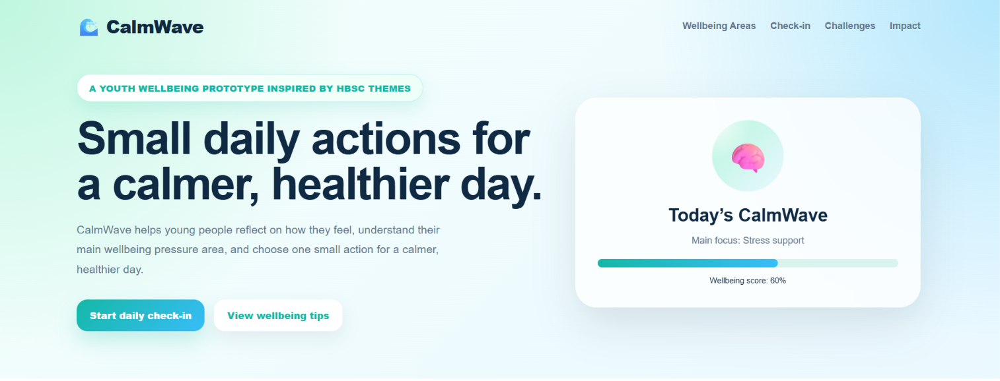
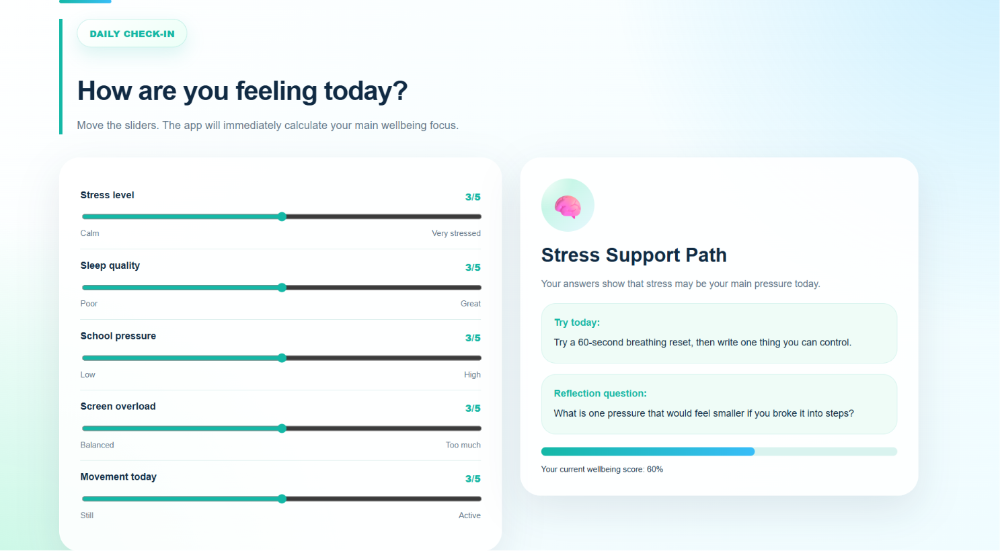
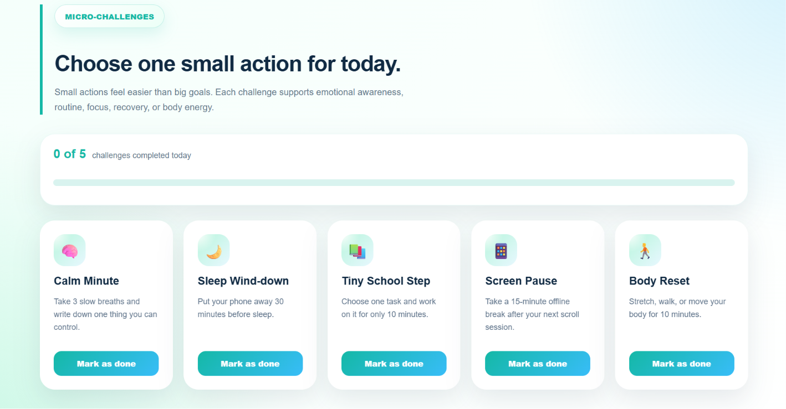

# CalmWave

CalmWave is a youth wellbeing web prototype inspired by HBSC themes. It helps young people reflect on how they feel, understand their main wellbeing pressure area, and choose one small supportive action for a calmer, healthier day.

## Preview

### Home page

### Daily check-in

### Micro-challenges

## Project idea

Many adolescents experience daily pressure connected to stress, sleep, school responsibilities, screen overload, and lack of movement. CalmWave turns these wellbeing areas into a simple interactive check-in and micro-challenge experience.

The app is not a diagnostic tool. It is designed as a safe self-reflection prototype that encourages emotional awareness and small behaviour changes.

## Target group

The target group is young people and adolescents, especially ages 11 to 15, which matches the HBSC focus on school-aged children and youth wellbeing.

## HBSC inspiration

CalmWave is inspired by HBSC wellbeing themes such as stress, sleep, school pressure, physical activity, digital wellbeing, healthy habits, and emotional awareness. The app does not present official HBSC statistics, but uses these themes to create an interactive self-reflection prototype.

## Main features

- Daily wellbeing check-in with sliders
- Personalized result based on the user's answers
- Wellbeing score
- Micro-challenges for small daily actions
- Saved challenge progress using localStorage
- Psychology and impact section
- Responsive blue-green interface

## Wellbeing areas

CalmWave focuses on:

- Stress
- Sleep
- School pressure
- Screen balance
- Movement

## Psychology behind the solution

The project uses:

- Self-reflection
- Emotional awareness
- Self-monitoring
- Small behaviour change
- Ethical, non-diagnostic guidance

Instead of asking young people to solve everything at once, CalmWave gives one realistic action for the day.

## Technologies used

- React
- Vite
- JavaScript
- CSS
- localStorage
- Git and GitHub

## How to run the project

Install dependencies:

npm install

Start development server:

npm run dev

Build for production:

npm run build

## Project purpose

This project was created as a digital solution for youth wellbeing. The goal is to show how an interactive web prototype can support awareness, healthy habits, and simple daily wellbeing actions.